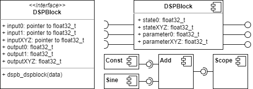

# DSP Blockset

Portable floating point single header DSP blockset library.

## Files
* [dsp_blockset_port.h](dsp_blockset_port.h) Portability layer to be adapted to target architecture.
* [dsp_blockset.h](dsp_blockset.h) Main dsp blockset library header file.
* [dsp_blockset_test.c](dsp_blockset_test.c) Main test file using UTEST single header unit testing framework.

## Block Structure

